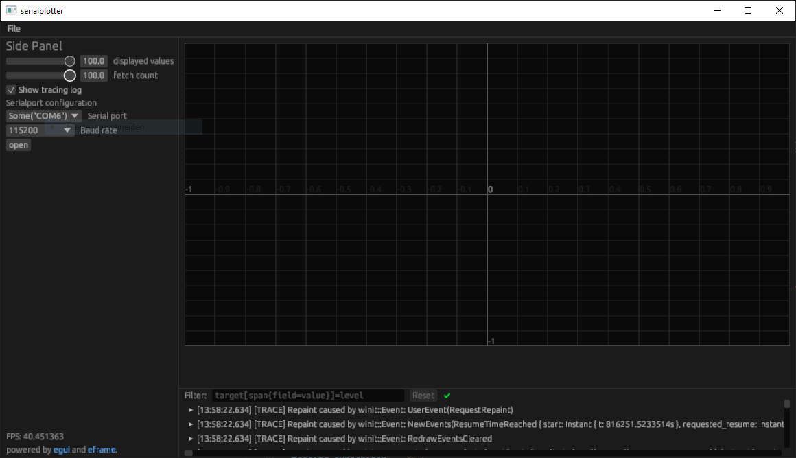

# Introduction

This is a tool to plot values from serial ports.
It is inspired by the Arduino Serialplotter from the Arduino IDE Version 1.x

The Serialplotter in the Arduino IDE Version 2 was not usable at the time of writing this application.

It is primarily a project for personal use and learning of technologies. It is my first application written using `egui`.

